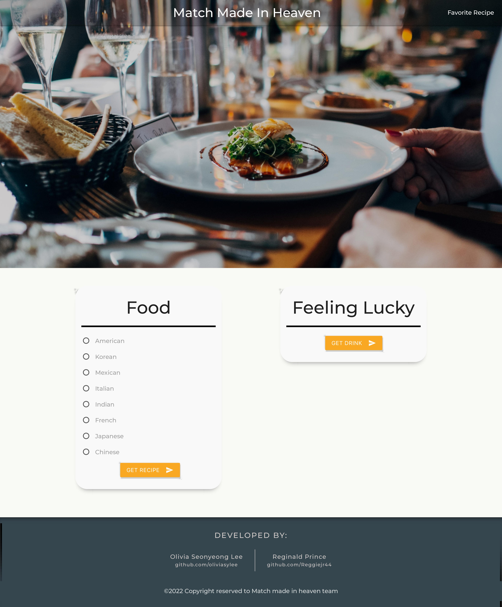

# The match made in heaven
## Description
Many people find it difficult to look for recipes they need to make a certain dish and sometimes it’s hard to choose what drink they want to match it with. Our team has created a web application that helps people decide what food and drink to enjoy together. With just one click, users can select from a variety of cuisine types, and we will provide them with a selection of ingredients and recipes, along with a random drink recipe to match. 
 
More time enjoying, less time thinking!  

## User story
As a user,  
I WANT to find recipes for the food I want to make, and I want to get recommendations for drinks that match the food.  
SO THAT I can make a delicious meal and accompany it with a perfect drink.  

GIVEN two sections named: Food and Feeling Lucky  
WHEN I choose one of a cuisine type and click “GET DRINK”  
THEN I’m presented with food name, ingredients and recipe link.  

WHEN I click “Get Drink”  
THEN I’m presented with a randomly selected drink's name, ingredients and instructions.  

WHEN I view favorite recipe,  
THEN I’m presented with saved recipe and drinks that match it.  

## Usage
To access the application, click the screenshot.

## Process
### Directions for the Future
-   
-   
-   

### Technology
- HTML
- CSS Framework: Materialize CSS
- jQuery
- APIs  
       - The Edamam API  
       - The Cocktail DB  

### Tasks and roles: 
- Front-end:  
- Back-end:  
- README:  
- Presentation:  

## Credits
- [Olivia Seonyeong Lee](https://github.com/oliviasylee)
- [Reginald Prince](https://github.com/Reggiejr44)
